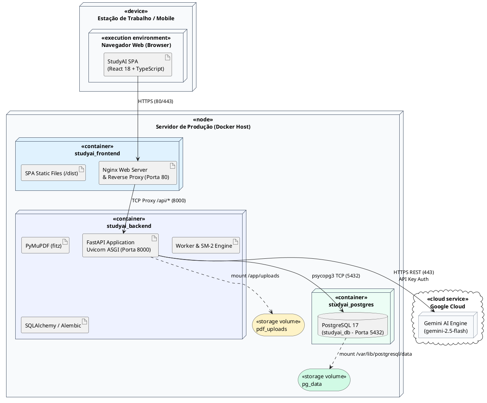
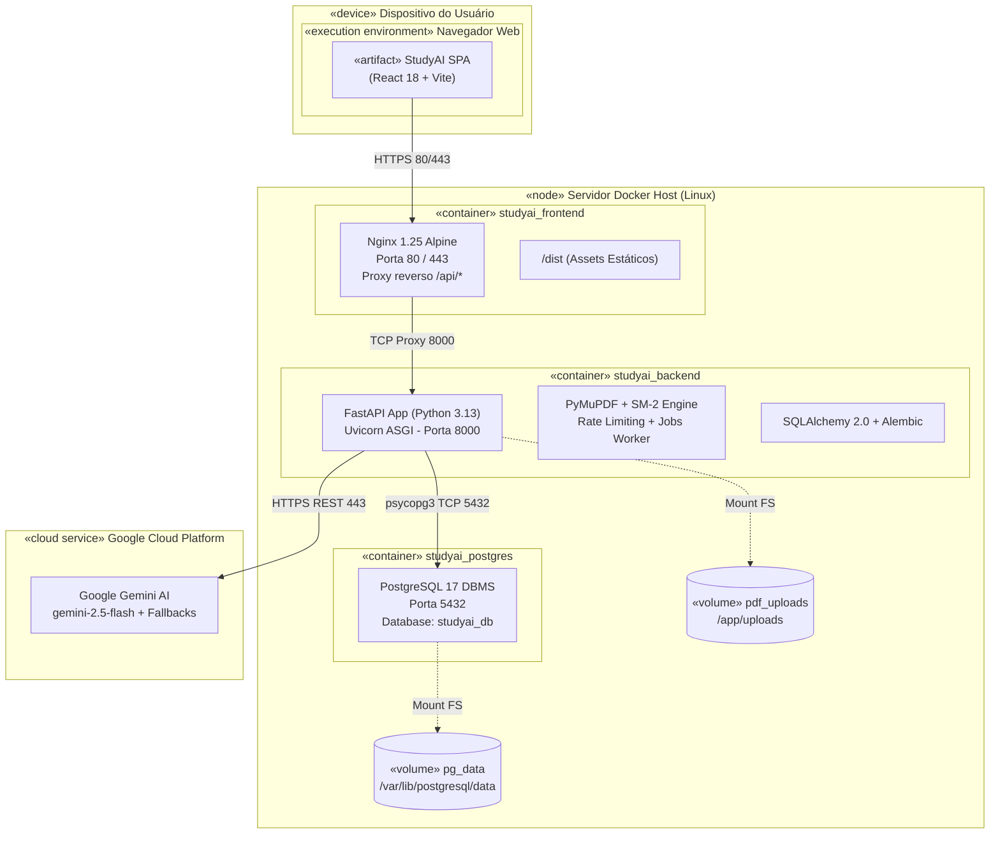

# Entrega de Engenharia de Software — Fase de Construção (Iteração 1)
## Diagrama de Implantação do Sistema StudyAI

**Disciplina:** Engenharia de Software / Projeto Integrado  
**Seção:** “Aplicando o conhecimento” — Momento com o Professor  
**Fase do Processo Unificado:** Construção (Iteração 1)  
**Artefato UML:** Diagrama de Implantação (*UML 2.5 Deployment Diagram*)  

---

### 1. Objetivo da Modelagem de Implantação

O objetivo deste diagrama é documentar formalmente a topologia de hardware, virtualização por contêineres (*Docker*), ambientes de execução e protocolos de comunicação que dão suporte aos casos de uso implementados nesta **Iteração 1 da Fase de Construção** do **StudyAI**:
- Autenticação e isolamento de usuários (JWT + Cookies HTTP-Only).
- Upload, validação de integridade (*magic bytes*) e extração textual de PDFs (PyMuPDF).
- Geração assíncrona de resumos e flashcards via Google Gemini com tolerância a falhas.
- Repetição espaçada baseada no algoritmo SuperMemo-2 (SM-2).
- Grafo de conhecimento com conexões bidirecionais e backlinks (estilo Obsidian).

---

### 2. Especificação dos Nós e Artefatos

O sistema adota uma arquitetura em 4 camadas (*tiers*) distribuídas e conteinerizadas:

```
[ Cliente: Navegador Web ] 
         │ HTTPS (80/443)
         ▼
[ Nó Servidor: Nginx (Proxy & SPA) ] 
         │ TCP Proxy (/api/* -> :8000)
         ▼
[ Nó Servidor: FastAPI (Python 3.13) ] ── (HTTPS 443) ──► [ Google Gemini AI ]
         │ TCP Wire Protocol (:5432)
         ▼
[ Nó Servidor: PostgreSQL 17 DBMS ]
```

#### Nó 1: `«device» :Estação de Trabalho / Dispositivo Móvel`
* **Ambiente de Execução:** `«execution environment» Navegador Web (Chrome, Firefox, Safari, Edge)`.
* **Artefato Implantado:** `«artifact» StudyAI SPA (React 18 + Vite + TypeScript)`.
* **Responsabilidade:** Renderização da interface reativa, modo escuro nativo (*Obsidian Theme*), gerenciamento de estado cliente, execução do revisor de flashcards e comunicação assíncrona via `fetch/API`.

#### Nó 2: `«node» Servidor de Produção / VPS (Linux Ubuntu Server)`
Ambiente hospedeiro onde reside o **Docker Engine** e o orquestrador **Docker Compose**. Contém 3 contêineres e 2 volumes persistentes:

1. **`«container» studyai_frontend` (Web Server & Reverse Proxy)**
   * **Imagem Base:** `nginx:alpine`.
   * **Porta Exposta:** `80` (HTTP) / `443` (HTTPS).
   * **Artefatos:**
     * `/dist`: Arquivos estáticos gerados no build do React (`index.html`, bundles JS, CSS, assets SVG).
     * `nginx.conf`: Configuração de roteamento SPA (`try_files $uri /index.html`), compressão gzip e proxy reverso da rota `/api/*` para o backend na porta interna `8000`.

2. **`«container» studyai_backend` (Application & API Server)**
   * **Imagem Base:** `python:3.13-slim`.
   * **Servidor ASGI:** `uvicorn` rodando com workers gerenciados na porta interna `8000`.
   * **Artefatos e Componentes:**
     * `FastAPI Application`: Roteamento REST, autenticação JWT, validação Pydantic v2 e Rate Limiter em memória.
     * `PyMuPDF Extractor`: Motor de leitura e validação binária de PDFs.
     * `JobWorker & BackgroundTasks`: Processador assíncrono de resumos e flashcards.
     * `SpacedRepetition Engine`: Implementação do algoritmo matemático SM-2.
     * `SQLAlchemy 2.0 ORM & Alembic`: Gerenciamento do pool de conexões e migrações versionadas.

3. **`«container» studyai_postgres` (Database Tier)**
   * **Imagem Base:** `postgres:17-alpine`.
   * **Porta Exposta:** `5432` (restrita à rede interna do Docker `studyai_network`).
   * **Artefato / Banco:** Banco de dados relacional `studyai_db` estruturado em 3NF com as tabelas: `users`, `materials`, `summaries`, `flashcards`, `material_connections`, `ai_jobs`, `study_plans` e `study_plan_items`.

4. **Volumes de Armazenamento Persistente:**
   * `«storage volume» pg_data`: Mapeado em `/var/lib/postgresql/data` no contêiner Postgres. Garante a integridade e persistência dos dados relacionais mesmo após atualizações ou paradas dos contêineres.
   * `«storage volume» pdf_uploads`: Mapeado em `/app/uploads` no backend. Armazena os arquivos físicos de PDF particionados por usuário (`/uploads/{user_id}/{uuid}.pdf`).

#### Nó 3: `«cloud service / external» Google Cloud Platform (Gemini AI)`
* **Serviço:** Google Gemini API.
* **Modelos:** `gemini-2.5-flash` (principal), com cadeia de contingência para `gemini-2.0-flash`, `gemini-1.5-flash` e `gemini-1.5-pro`.
* **Comunicação:** Protocolo HTTPS seguro (porta 443) autenticado via token de API (`GEMINI_API_KEY`) com mecanismo de repetição exponencial (*exponential backoff*).

---

### 3. Matriz de Conexões e Protocolos de Rede

| Origem | Destino | Protocolo / Canal | Porta | Finalidade |
|---|---|---|---|---|
| Cliente (Browser) | `studyai_frontend` (Nginx) | HTTPS / TLS 1.3 | 443 / 80 | Carregamento da SPA e envio de requisições de usuário |
| `studyai_frontend` (Nginx) | `studyai_backend` (FastAPI) | HTTP / REST (TCP) | 8000 | Encaminhamento transparente das requisições sob `/api/*` |
| `studyai_backend` (FastAPI) | `studyai_postgres` (Postgres) | PostgreSQL Wire (TCP) | 5432 | Consultas transacionais ACID via driver `psycopg3` |
| `studyai_backend` (FastAPI) | `pdf_uploads` (Storage) | Host POSIX Mount | Local | Leitura e escrita de PDFs originais extraídos |
| `studyai_backend` (FastAPI) | Google Gemini AI | HTTPS REST / JSON | 443 | Envio de prompts e recebimento de resumos e flashcards |

---

### 4. Código-fonte do Diagrama (PlantUML)

Para compilar ou editar no PlantUML (*plantuml.com* ou plugin do VS Code):



---

### 5. Código-fonte do Diagrama (Mermaid)

Para visualização nativa em plataformas como GitHub, Notion e Markdown Preview:



---

### 6. Conformidade com a Seção “Aplicando o Conhecimento”

1. **Rastreabilidade dos Requisitos:** Cada nó e contêiner responde diretamente às histórias de usuário e componentes centrais da Iteração 1 (Autenticação, Upload seguro de PDFs, Flashcards SM-2 e Grafo de Conhecimento).
2. **Prontidão para o Momento com o Professor:** O diagrama está acompanhado da fundamentação de portas, isolamento de rede, resiliência da IA e garantia de persistência relacional ACID.
